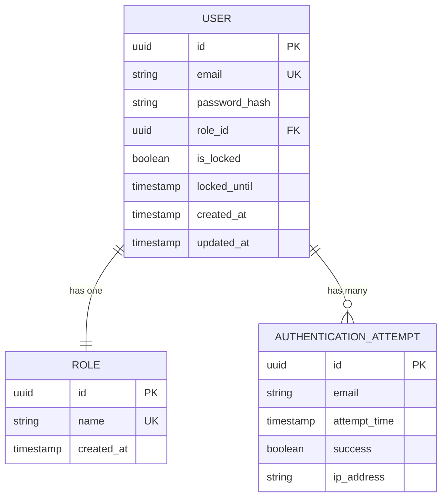

# Data Model: User Authentication System

**Feature**: 001-user-auth  
**Date**: 2026-02-25  
**Status**: Complete

## Purpose

This document defines the data entities, relationships, validation rules, and state transitions for the user authentication system. All entities map to PostgreSQL tables via Spring Data JPA.

---

## Entity Overview



---

## Entity Definitions

### Entity: User

**Purpose**: Represents a registered user account in the InnovatEPAM Portal.

**Table Name**: `users`

#### Attributes

| Field | Type | Constraints | Description |
|-------|------|-------------|-------------|
| `id` | UUID | PRIMARY KEY, NOT NULL, DEFAULT gen_random_uuid() | Unique identifier for the user |
| `email` | VARCHAR(255) | UNIQUE, NOT NULL | User's email address (login credential) |
| `password_hash` | VARCHAR(255) | NOT NULL | BCrypt-hashed password (never store plain text) |
| `role_id` | UUID | FOREIGN KEY → roles(id), NOT NULL | Reference to user's assigned role |
| `is_locked` | BOOLEAN | DEFAULT FALSE | Account lock status (true = locked) |
| `locked_until` | TIMESTAMP | NULL | Timestamp when account lock expires (null = not locked) |
| `created_at` | TIMESTAMP | DEFAULT CURRENT_TIMESTAMP | Account creation timestamp |
| `updated_at` | TIMESTAMP | DEFAULT CURRENT_TIMESTAMP | Last update timestamp |

#### Validation Rules

- **email**:
  - MUST match RFC 5322 email format (regex validation)
  - MUST be unique across all users (enforced at DB level via UNIQUE constraint)
  - Case-insensitive for comparison (normalize to lowercase before storage)
  - Trim leading/trailing whitespace before validation
  - Max length: 255 characters
  
- **password** (before hashing):
  - MUST be at least 8 characters
  - MUST NOT be in common password list (top 10,000)
  - Trim leading/trailing whitespace before hashing
  - Hashed using BCrypt with cost factor 12 before storage
  - Never stored in plain text (only `password_hash` persisted)
  
- **role_id**:
  - MUST reference existing role in `roles` table
  - MUST NOT be null
  - Immutable after creation (role changes require separate admin feature)
  
- **is_locked**:
  - Automatically set to `true` when 5 failed login attempts occur within 15 minutes
  - Automatically set to `false` when `locked_until` timestamp passes
  
- **locked_until**:
  - Set to CURRENT_TIMESTAMP + 30 minutes when account locked
  - Null when account not locked

#### Relationships

- **User → Role**: Many-to-One (each user has exactly one role)
- **User → AuthenticationAttempt**: One-to-Many (user can have multiple login attempts)

#### Indexes

```sql
CREATE INDEX idx_users_email ON users(email);       -- Fast email lookups for login
CREATE INDEX idx_users_role ON users(role_id);      -- Fast role-based queries
CREATE INDEX idx_users_locked ON users(is_locked);  -- Fast locked account queries
```

#### State Transitions

```
[New User Request]
    ↓
[Validation] → [Invalid] → [400 Bad Request]
    ↓ [Valid]
[Check Email Uniqueness] → [Duplicate] → [409 Conflict]
    ↓ [Unique]
[Hash Password (BCrypt)]
    ↓
[Create User Record (is_locked=false)]
    ↓
[Return Success (201 Created)]

[Login Attempt]
    ↓
[Check if Locked] → [Locked] → [403 Forbidden: "Account locked. Try again at {locked_until}"]
    ↓ [Not Locked]
[Verify Email Exists] → [Not Found] → [Track Failed Attempt] → [401 Unauthorized]
    ↓ [Found]
[Verify Password (BCrypt)] → [Mismatch] → [Track Failed Attempt] → [Check Lock Threshold] → [401 Unauthorized]
    ↓ [Match]
[Generate JWT Token]
    ↓
[Return Token (200 OK)]

[Failed Login Attempts]
    ↓
[Count Recent Failures (last 15 min)]
    ↓
[>= 5 Failures] → [Set is_locked=true, locked_until=NOW+30min] → [403 Forbidden]
    ↓ [< 5 Failures]
[Return 401 Unauthorized]
```

#### JPA Entity Example

```java
@Entity
@Table(name = "users")
public class User {
    @Id
    @GeneratedValue(strategy = GenerationType.UUID)
    private UUID id;
    
    @Column(unique = true, nullable = false, length = 255)
    private String email;
    
    @Column(name = "password_hash", nullable = false, length = 255)
    private String passwordHash;
    
    @ManyToOne(fetch = FetchType.EAGER)
    @JoinColumn(name = "role_id", nullable = false)
    private Role role;
    
    @Column(name = "is_locked", nullable = false)
    private Boolean isLocked = false;
    
    @Column(name = "locked_until")
    private LocalDateTime lockedUntil;
    
    @CreatedDate
    @Column(name = "created_at", nullable = false, updatable = false)
    private LocalDateTime createdAt;
    
    @LastModifiedDate
    @Column(name = "updated_at", nullable = false)
    private LocalDateTime updatedAt;
    
    // Getters, setters, constructors
    
    public boolean isAccountLocked() {
        return isLocked && lockedUntil != null && LocalDateTime.now().isBefore(lockedUntil);
    }
}
```

---

### Entity: Role

**Purpose**: Represents a user's access level (submitter or evaluator/admin).

**Table Name**: `roles`

#### Attributes

| Field | Type | Constraints | Description |
|-------|------|-------------|-------------|
| `id` | UUID | PRIMARY KEY, NOT NULL, DEFAULT gen_random_uuid() | Unique identifier for the role |
| `name` | VARCHAR(50) | UNIQUE, NOT NULL | Role name: "submitter" or "evaluator/admin" |
| `created_at` | TIMESTAMP | DEFAULT CURRENT_TIMESTAMP | Role creation timestamp |

#### Validation Rules

- **name**:
  - MUST be one of two predefined values: `"submitter"` or `"evaluator/admin"`
  - Case-sensitive (lowercase preferred)
  - UNIQUE constraint prevents duplicate role names
  - Immutable after creation (roles created during application initialization)

#### Relationships

- **Role → User**: One-to-Many (role can be assigned to multiple users)

#### Seed Data

```sql
-- Roles created during application initialization (Flyway migration)
INSERT INTO roles (id, name, created_at) VALUES 
    ('00000000-0000-0000-0000-000000000001', 'submitter', CURRENT_TIMESTAMP),
    ('00000000-0000-0000-0000-000000000002', 'evaluator/admin', CURRENT_TIMESTAMP);
```

#### JPA Entity Example

```java
@Entity
@Table(name = "roles")
public class Role {
    @Id
    @GeneratedValue(strategy = GenerationType.UUID)
    private UUID id;
    
    @Column(unique = true, nullable = false, length = 50)
    private String name;
    
    @CreatedDate
    @Column(name = "created_at", nullable = false, updatable = false)
    private LocalDateTime createdAt;
    
    @OneToMany(mappedBy = "role")
    private List<User> users;
    
    // Getters, setters, constructors
}
```

---

### Entity: AuthenticationAttempt

**Purpose**: Tracks login attempts for rate limiting and account lockout.

**Table Name**: `authentication_attempts`

#### Attributes

| Field | Type | Constraints | Description |
|-------|------|-------------|-------------|
| `id` | UUID | PRIMARY KEY, NOT NULL, DEFAULT gen_random_uuid() | Unique identifier for  the attempt |
| `email` | VARCHAR(255) | NOT NULL | Email address used in login attempt |
| `attempt_time` | TIMESTAMP | DEFAULT CURRENT_TIMESTAMP | When the login attempt occurred |
| `success` | BOOLEAN | NOT NULL | True if login succeeded, false if failed |
| `ip_address` | VARCHAR(45) | NULL | IP address of the request (IPv6 support: 45 chars) |

#### Validation Rules

- **email**:
  - NOT NULL (must always be provided)
  - No uniqueness constraint (same email can have multiple attempts)
  - Stored as provided (not normalized; used for tracking only)
  
- **success**:
  - Boolean: `true` = successful login, `false` = failed login
  - Used to filter recent failed attempts for lockout logic
  
- **ip_address**:
  - Optional (can be null)
  - VARCHAR(45) supports IPv4 (15 chars max) and IPv6 (39 chars max)
  - Captured from HTTP request header (`X-Forwarded-For` or `RemoteAddr`)

#### Relationships

- **AuthenticationAttempt → User**: Many-to-One (via email, not FK)
  - Note: No formal FK constraint; email stored for tracking even if user doesn't exist

#### Indexes

```sql
CREATE INDEX idx_auth_attempts_email_time ON authentication_attempts(email, attempt_time);
-- Enables fast queries: "Find failed attempts for email in last 15 minutes"
```

#### Retention Policy

- **Cleanup Strategy**: Delete attempts older than 30 days (scheduled job)
- **Rationale**: Prevents table growth; 30 days sufficient for audit trail

#### JPA Entity Example

```java
@Entity
@Table(name = "authentication_attempts")
public class AuthenticationAttempt {
    @Id
    @GeneratedValue(strategy = GenerationType.UUID)
    private UUID id;
    
    @Column(nullable = false, length = 255)
    private String email;
    
    @Column(name = "attempt_time", nullable = false)
    private LocalDateTime attemptTime = LocalDateTime.now();
    
    @Column(nullable = false)
    private Boolean success;
    
    @Column(name = "ip_address", length = 45)
    private String ipAddress;
    
    // Getters, setters, constructors
}
```

---

## DTO (Data Transfer Objects)

DTOs are used to transfer data between frontend and backend, decoupling internal entities from API contracts.

### RegisterRequest DTO

**Purpose**: Request payload for user registration endpoint.

```java
public record RegisterRequest(
    @NotBlank(message = "Email is required")
    @Email(message = "Invalid email format")
    String email,
    
    @NotBlank(message = "Password is required")
    @Size(min = 8, message = "Password must be at least 8 characters")
    String password,
    
    @NotBlank(message = "Role is required")
    @Pattern(regexp = "^(submitter|evaluator/admin)$", message = "Role must be 'submitter' or 'evaluator/admin'")
    String role
) {}
```

### LoginRequest DTO

**Purpose**: Request payload for user login endpoint.

```java
public record LoginRequest(
    @NotBlank(message = "Email is required")
    @Email(message = "Invalid email format")
    String email,
    
    @NotBlank(message = "Password is required")
    String password
) {}
```

### AuthResponse DTO

**Purpose**: Response payload for successful authentication (registration or login).

```java
public record AuthResponse(
    String token,           // JWT token
    String email,           // User's email
    String role,            // User's role name
    UUID userId,            // User's ID
    Long expiresIn          // Token expiration (seconds from now, e.g., 86400 for 24h)
) {}
```

### ErrorResponse DTO

**Purpose**: Standardized error response for all API errors.

```java
public record ErrorResponse(
    int status,            // HTTP status code (e.g., 400, 401, 409)
    String message,        // Human-readable error message
    String timestamp,      // ISO 8601 timestamp
    String path            // Request path that caused error
) {}
```

---

## Validation Summary

| Entity | Required Fields | Unique Fields | Immutable Fields | Indexed Fields |
|--------|----------------|---------------|------------------|----------------|
| **User** | email, password_hash, role_id | email | id, created_at | email, role_id, is_locked |
| **Role** | name | name | id, name, created_at | name |
| **AuthenticationAttempt** | email, success | — | id, attempt_time | email + attempt_time |

---

## Database Constraints Summary

```sql
-- Primary Keys
ALTER TABLE users ADD PRIMARY KEY (id);
ALTER TABLE roles ADD PRIMARY KEY (id);
ALTER TABLE authentication_attempts ADD PRIMARY KEY (id);

-- Foreign Keys
ALTER TABLE users ADD CONSTRAINT fk_users_role FOREIGN KEY (role_id) REFERENCES roles(id);

-- Unique Constraints
ALTER TABLE users ADD CONSTRAINT uq_users_email UNIQUE (email);
ALTER TABLE roles ADD CONSTRAINT uq_roles_name UNIQUE (name);

-- Check Constraints
ALTER TABLE users ADD CONSTRAINT chk_email_format CHECK (email ~* '^[A-Za-z0-9._%+-]+@[A-Za-z0-9.-]+\.[A-Za-z]{2,}$');
ALTER TABLE roles ADD CONSTRAINT chk_role_name CHECK (name IN ('submitter', 'evaluator/admin'));
```

---

## Migration Strategy

**Tool**: Flyway (version-controlled SQL migrations)

**Migration Files** (in `backend/src/main/resources/db/migration/`):

1. **V1__create_roles_table.sql**:
   ```sql
   CREATE TABLE roles (
       id UUID PRIMARY KEY DEFAULT gen_random_uuid(),
       name VARCHAR(50) UNIQUE NOT NULL,
       created_at TIMESTAMP DEFAULT CURRENT_TIMESTAMP
   );
   
   INSERT INTO roles (id, name) VALUES 
       ('00000000-0000-0000-0000-000000000001', 'submitter'),
       ('00000000-0000-0000-0000-000000000002', 'evaluator/admin');
   ```

2. **V2__create_users_table.sql**:
   ```sql
   CREATE TABLE users (
       id UUID PRIMARY KEY DEFAULT gen_random_uuid(),
       email VARCHAR(255) UNIQUE NOT NULL,
       password_hash VARCHAR(255) NOT NULL,
       role_id UUID NOT NULL REFERENCES roles(id),
       is_locked BOOLEAN DEFAULT FALSE,
       locked_until TIMESTAMP,
       created_at TIMESTAMP DEFAULT CURRENT_TIMESTAMP,
       updated_at TIMESTAMP DEFAULT CURRENT_TIMESTAMP
   );
   
   CREATE INDEX idx_users_email ON users(email);
   CREATE INDEX idx_users_role ON users(role_id);
   ```

3. **V3__create_authentication_attempts_table.sql**:
   ```sql
   CREATE TABLE authentication_attempts (
       id UUID PRIMARY KEY DEFAULT gen_random_uuid(),
       email VARCHAR(255) NOT NULL,
       attempt_time TIMESTAMP DEFAULT CURRENT_TIMESTAMP,
       success BOOLEAN NOT NULL,
       ip_address VARCHAR(45)
   );
   
   CREATE INDEX idx_auth_attempts_email_time ON authentication_attempts(email, attempt_time);
   ```

---

## Summary

✅ **3 Core Entities**: User, Role, AuthenticationAttempt  
✅ **Relationships**: User ↔ Role (Many-to-One), User ↔ AuthenticationAttempt (One-to-Many)  
✅ **Validation**: Email uniqueness, password strength, role enum  
✅ **State Management**: Account locking based on failed attempts  
✅ **Indexes**: Optimized for email lookups, role queries, failed attempt tracking  
✅ **DTOs**: Decoupled API contracts from internal entities  
✅ **Migrations**: Flyway version-controlled schema changes  

**Status**: ✅ Data model complete. Ready for contract definition (Phase 1 continues).
